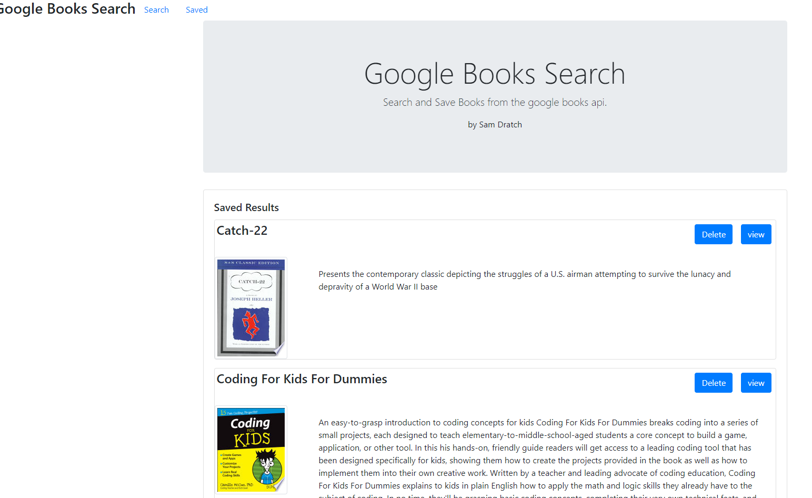

# HW21-book-search
## Description
This program is made to be able to save books to a saved list using the google book api

## Search Page
The search page will have an input field to search for a book by title.
The list of results will have two buttons save and view
The save button saves the book to the database
The view button takes the user to the google book page

## Saved Page
The saved page will show a list of all books that the user has saved
The The list of results will have two buttons delete and view
The delete button delets the book from the saved database
The view button takes the user to the google book page

## Links

* [Github Repo](https://github.com/sdratch/HW21-book-search)
* [Heroku deployed](https://cryptic-taiga-10761.herokuapp.com/)

## Image

